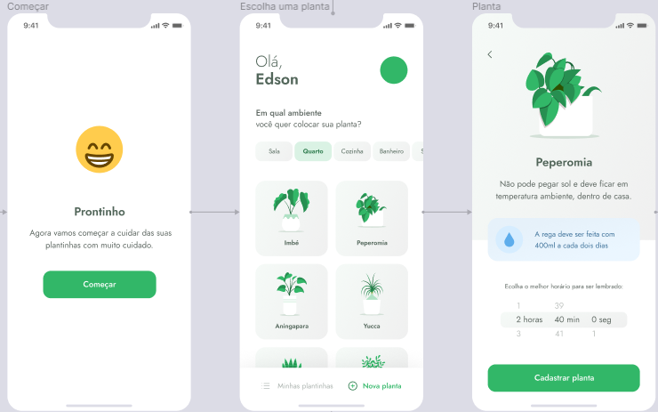
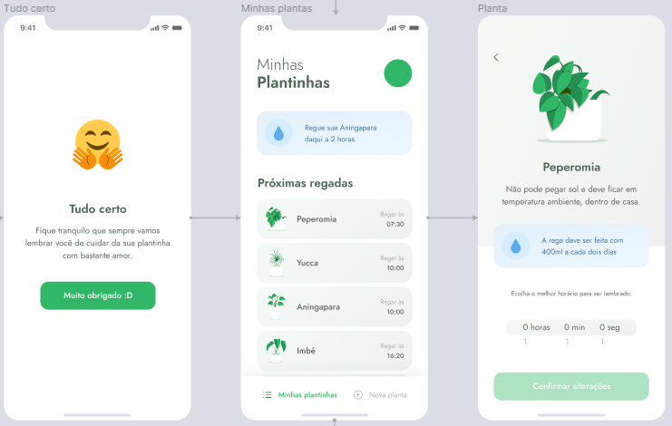
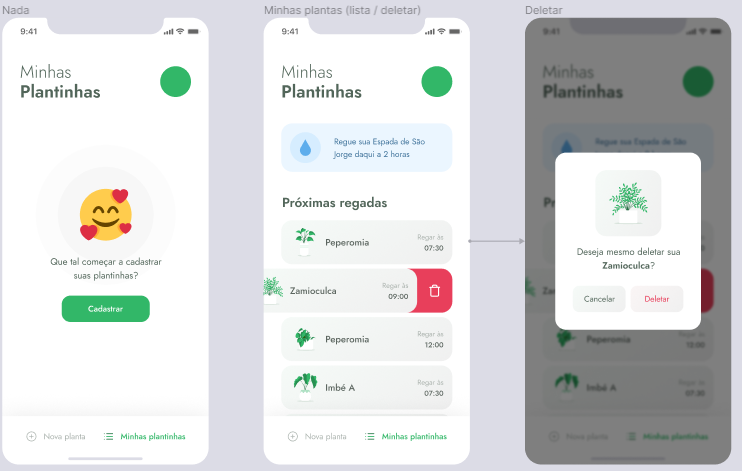

<p align="center">
  
</p>

<p align="center">
  <a href="#-tecnology">Tecnology</a>&nbsp;&nbsp;&nbsp;|&nbsp;&nbsp;&nbsp;
  <a href="#-project">Project</a>&nbsp;&nbsp;&nbsp;|&nbsp;&nbsp;&nbsp;
  <a href="#-license">License</a>
</p>

<p align="center">
 

  
</p>

<br>

## 💻 Project

##### Projeto Mobile Construido durante o NLW5

<p>Plant Manager é um projeto desenvolvido para ios e android com react-native onde o objetivo é ajudar as pessoas a cuidar melhor de suas plantas onde o usuário cadastra suas plantas vindo de um backend e sendo notificado de rega-las. </P>


# Preview 🛰

<p align="center">
  
</p>
<p align="center">
  
</p>
<p align="center">
  
</p>
<p align="center">
  
</p>

## 🚀 Technology

This project was developed with the following technologies:

- [React-Native]()
- [expo]()
- [json-server]()


## 🛠 Install

1. Clone o repositório:

   ```bash
   $ git clone https://github.com/edsnasc/Plant-Manager.git
   ```
2. execute os comandos 

    ```bash
    $npm install - instale as dependencias
    $json-server ./src/services/server.json --host 000.000.00.00 -> (seu host) --port 3333 - execute o server
    $expo start - execute o projeto
   ```
---

Created by Edson Nascimento 🚀/ [LinkedIn](https://www.linkedin.com/in/edson-nascimento-5783681aa/)